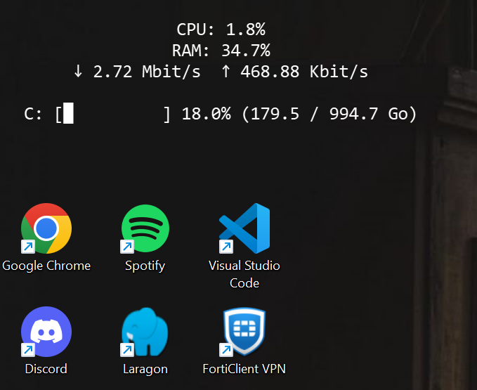

# 🖥️ Minimalist Windows System Monitor Widget (PyQt6)

  
*A simple and clean system monitoring widget that tracks CPU, RAM, network speed, and disk usage in real-time.*

## 🚀 Why This Widget?
This **lightweight, frameless, and always-on-bottom** desktop widget provides **real-time** monitoring of your system's essential stats without taking up unnecessary screen space.

✅ **Live CPU & RAM usage tracking**  
✅ **Real-time network speed monitoring** (Upload/Download)  
✅ **Animated ASCII-based disk space bar**  
✅ **Frameless, dark-themed, minimal UI**  
✅ **Auto-start at Windows boot**  

---

## 📥 Installation
### 1️⃣ Clone this Repository

### 2️⃣ Install Required Libraries
Ensure you have **Python 3** installed. Then install dependencies:
```sh
pip install -r requirements.txt
```
Or manually install:
```sh
pip install PyQt6 psutil
```

### 3️⃣ Run the Widget
```sh
python widget.py
```

---

## 🔄 Auto-Start at Windows Boot Using a `.bat` File
1. Open **Notepad** and paste the following:
    ```bat
    @echo off
    start /b "" "C:\path\to\pythonw.exe" "C:\path\to\widget.py"
    exit
    ```
2. Save the file as:
    ```
    widget_start.bat
    ```
3. Move it to the **Startup folder**:
    - Press `Win + R`, type `shell:startup`, and hit `Enter`
    - Copy `widget_start.bat` into the opened folder
4. Restart your PC, and the widget will launch automatically! 🎉

---

## ⚙ Customization
You can tweak the widget's appearance and behavior:
- **Modify disk monitoring** (`C:\` → another drive)
- **Adjust refresh intervals** (`self.timer.start(1000)`, modify for faster/slower updates)
- **Change bar length** (`bar_length = 20`)
- **Customize fonts, colors, and layout** via PyQt6 stylesheets

---

## 🛠 Troubleshooting
### ❓ Widget doesn’t appear on startup
- Double-check that `widget_start.bat` is inside the **Startup folder** (`shell:startup`).

### ❓ Python console window remains open  (common issue)
- Use `pythonw.exe` instead of `python.exe` in your `.bat` file.

### ❓ PyQt6 ImportError
- Ensure dependencies are correctly installed:
  ```sh
  pip install PyQt6 psutil
  ```

---

## 💡 Future Improvements (maybe)
🔹 GPU temperature monitoring  
🔹 Customizable widget placement  
🔹 Multi-disk monitoring support  
🔹 More UI customizations (themes, transparency, animations)  

---

## 🎯 Contributions
Pull requests and feature suggestions are welcome! Feel free to open an issue for bugs, ideas, or improvements.

👨‍💻 **Developed by [Tom Deneyer]**  
🔗 **GitHub Repository:** [https://github.com/Littl3T/Minimalist-Windows-System-Monitor-Widget-PyQt6-]

